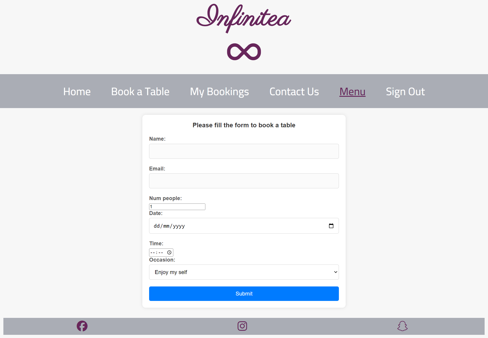
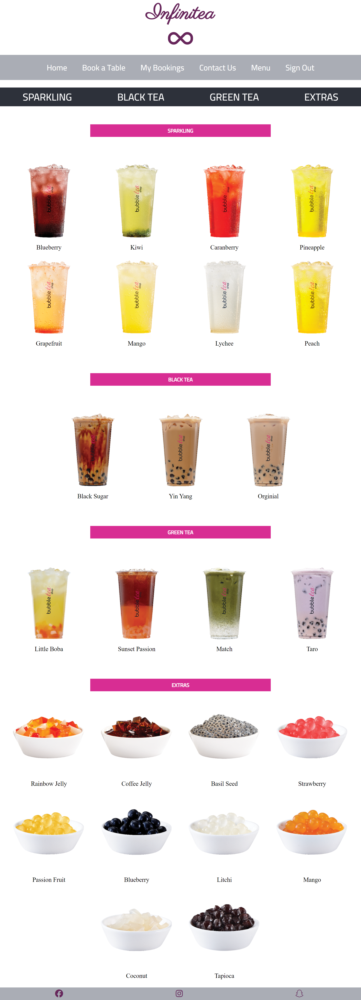

# Infinitea

## Features

The web application has the following pages:
- home page
- menu page
- login page
- registration page
- book a table page
- my bookings page
- contact us page

- Each page has a navbar and a footer

**Navbar**

Navbar has the following links:
- Home page
- 

The simplistic design of the navbar is based on the decision to make the use of the web app easy for the user.

- Book a Table page
If the user not logged in, he will be redirected to login page.
- 

After the user login, he will be directed to the booking form.
- 

After filling the booking form and clicking on submit button, the user will be redirected to the booking page.
- 

The user can book multiple bookings.
- 

- My Bookings page
If there is no bookings
- 

If the user had booking
- 

- Contact Us page
- 

After filling contact form, the user will be redirected to thank you page
- 

- Menu page
- 

- Register Page
- 

After filling the register form the user will be redirected to the login page
- 

- Edit Booking

When the user click on edit booking, he will be redirected to the booking form again

- 

- Delete Booking

When the user click on Delete booking, an alert message will popup for the user

- 

- Footer, have the social media accounts
- 