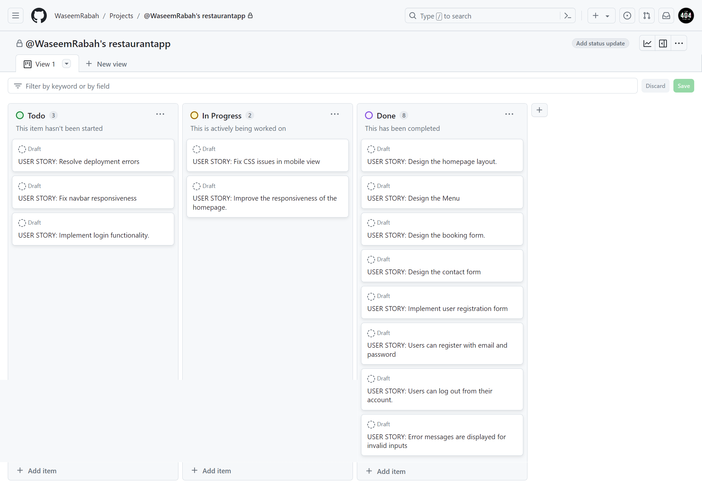

# Infintea

Live Version: [Infintea](https://django-restaurant-app-c1be60f07ecd.herokuapp.com/)

Repository: [GitHub Repo](https://github.com/WaseemRabah/restaurantapp)

The app is developed by [Waseem Rabah](https://github.com/WaseemRabah).

## Introduction
[Infintea](https://django-restaurant-app-c1be60f07ecd.herokuapp.com/) is your go-to destination for delicious bubble tea. We specialize in crafting the finest bubble tea beverages and offer the convenience of reserving a table for an enjoyable  experience.

### Target Audience

Infintea Bubble Tea is designed to cater to a diverse range of users, and our target audience includes:

1. **Bubble Tea Enthusiasts**: Individuals who have a passion for bubble tea, appreciate a variety of flavors, and enjoy discovering unique combinations.
2. **Busy Professionals**: On-the-go individuals seeking a quick and convenient way to order and pick up their favorite bubble tea.
3. **Students**: Students looking for a relaxed space to study, socialize, or enjoy a refreshing beverage between classes.
4. **Event Planners**: Organizers who wish to reserve tables for special events, gatherings, or celebrations at our restaurant.
5. **Local Community**: Residents and regulars who consider Infintea their neighborhood hangout spot for delicious drinks and relaxation.

By understanding and addressing the needs and preferences of our diverse target audience, we aim to create a versatile and inclusive user experience that appeals to a wide range of customers.

# Design

## Agile Strategy
The Agile methodology was used to plan and create this project. I used the Projects tool within GitHub to manage the different processes needed for this project to be completed.
You can see the project created [here](https://github.com/users/WaseemRabah/projects/2/views/1)

- User Stories were created through GitHub Issues to highlight features for possible implementation.
- These User Stories were then assigned a label from these options - 'Could Have', 'Should Have' and 'Must Have'. These labels helped to prioritise which features needed to be implemented first.

After completing this project I saw the capability to use Epics (GitHub Milestones). These can give User Stories an overall theme to a group of User Stories - this is a feature within GitHub that I will research and use in future projects as I wasn't aware of this until after completing this project.

### Project Goals
The Infinitea Bubble Tea website is designed to create a comprehensive, user-friendly platform for bubble tea enthusiasts and shop owners.

### Scope

#### In-Scope

1. **User Interface and User Experience (UI/UX)**
   - Responsive and intuitive website layout.
   - Home, menu, contact, and user account pages.

2. **Product Management**
   - Menu with images.

3. **User Accounts and Profiles**
   - User registration and login.

4. **Branding and Content**
   - Infinitea branding (logos, colors, typography).

### Structure

The plan for the structure of this was as follows -

**At Minimum**
- Home Page, Menu Pages, Account Page - Login, Logout, Sign Up.

### User Stories

#### **First Time Visitor Goals**

1. **Discover Our Menu**: Explore our extensive menu of bubble tea flavors, Get a sense of the delightful choices we offer.
2. **Explore Our Table Reservation Feature**: If you're planning to  enjoy a sit-down experience, we invite you to discover and use our table reservation feature.
3. **Learn About Our Specials**: Check out any ongoing promotions, special offers, or unique creations that might be available during your visit.
4. **Contact Us**: Feel free to reach out to us with any questions, feedback, or inquiries. We're here to assist you.
5. **Provide Feedback**: If you've used our app or visited our restaurant, we appreciate your feedback and encourage you to share your experience with us.

Our aim is to make your first visit to Infintea Bubble Tea informative, enjoyable, and convenient. We hope you have a delightful experience and consider us for your future bubble tea needs.

#### **Frequent Visitor Goals**

1. **Explore New Flavors**: Be adventurous and try a different bubble tea flavor or one of our seasonal specialties during each visit.
2. **Loyalty Rewards**: Take advantage of our loyalty rewards program to earn points, discounts, or free items with each purchase.
3. **Reserve Tables for Gatherings**: If you plan to meet friends or family at our restaurant, use our table reservation feature to secure a cozy spot in advance.
4. **Connect on Social Media**: Follow us on social media platforms for news, updates, and to engage with our vibrant community of bubble tea enthusiasts.

#### **Potential Client Goals**

1. **Explore Our Offerings**: Take your time to explore our menu, discover the variety of bubble tea flavors.
2. **Get to Know Our Brand**: Learn about our brand, our commitment to quality, and what sets us apart in the world of bubble tea.
3. **Plan Your Visit**: Use our app to plan your visit, reserve a table, and prepare for a delightful experience.

---

## Technologies used

- ### Languages:

    + [Python 3.11.4](https://www.python.org/downloads/release/python-3114/): the primary language used to develop the server-side of the website.
    + [HTML](https://developer.mozilla.org/en-US/docs/Web/HTML): the markup language used to create the website.
    + [CSS](https://developer.mozilla.org/en-US/docs/Web/css): the styling language used to style the website.

- ### Frameworks and libraries:
    + [Django](https://www.djangoproject.com/): python framework used to create all the logic.

- ### Databases:

    + [SQLite](https://www.sqlite.org/): was used as a development database.
    + [PostgreSQL](https://www.postgresql.org/): the database used to store all the data.

- ### Other tools:

    + [Git](https://git-scm.com/): the version control system used to manage the code.
    + [Pip3](https://pypi.org/project/pip/): the package manager used to install the dependencies.
    + [Gunicorn](https://gunicorn.org/): the webserver used to run the website.
    + [Spycopg2](https://www.python.org/dev/peps/pep-0249/): the database driver used to connect to the database.
    + [Django-crispy-forms](https://django-cryptography.readthedocs.io/en/latest/): was used to control the rendering behavior of Django forms.
    + [Render](https://render.com/): the cloud platform used to host the website.
    + [ElephantSQL](https://www.elephantsql.com/): the cloud database used to store all the data.
    + [GitHub](https://github.com/): used to host the website's source code.
    + [VSCode](https://code.visualstudio.com/): the IDE used to develop the website.
    + [Chrome DevTools](https://developer.chrome.com/docs/devtools/open/): was used to debug the website.
    + [Font Awesome](https://fontawesome.com/): was used to create the icons used in the website.
    + [Draw.io](https://www.lucidchart.com/) was used to make a flowchart for the README file.
    + [Coolors](https://coolors.co/202a3c-1c2431-181f2a-0b1523-65e2d9-925cef-6b28e0-ffffff-eeeeee) was used to make a color palette for the website.

---

## FEATURES

Please refer to the [FEATURES.md](FEATURES.md) file for all features-related documentation.

---

## Design

The design of the Infintea Bubble Tea app is crafted with the intention of creating an inviting and visually appealing user experience. 

### Color Scheme

The color scheme of the application is based on the bold colors:

### Typography

- **Cairo Font**: The Cairo font is employed for various textual elements throughout the app, providing a modern and easy-to-read typeface. It is used for general text, menu descriptions, and other informational content.

- **Parsienne Font**: The Parsienne font is featured in our logo and "Contact Us" section. This elegant and stylish font adds a touch of sophistication and uniqueness to these specific elements.

### Wireframes

- [Desktop Wireframes](documentation/desktop_wireframe.pdf)
- [Mobile Wireframes](documentation/mobile_wirframe.pdf)

---

## Agile Methodology

### GitHub Project Management

 

GitHub Project Management was used to manage the project. If it hadn't been for the GitHub project management, I wouldn't have been able to manage the development of the application. It helped me to prioritize the tasks and to keep track of my progress.

## Flowchart

- [Flowchart](documentation/Blank%20diagram.pdf)

## Information Architecture

### Database

* During the earliest stages of the project, the database was created using SQLite.
* The database was then migrated to PostgreSQL.

### Entity-Relationship Diagram

# Database Schema

## Tables

1. **auth_user** (Django's default User model table)
2. **Booking**
3. **ContactMessage**

## Table: `Booking`

| Column Name     | Data Type      | Constraints                             | Description                                           |
|-----------------|----------------|-----------------------------------------|-------------------------------------------------------|
| `id`              | Integer        | Primary Key, Auto Increment             | Unique identifier for each booking                    |
| `user_id`         | Integer        | Foreign Key to `auth_user(id)`, Not Null | Reference to the user making the booking              |
| `name`            | Varchar(30)    | Not Null                                | Name of the person who made the booking               |
| `email`           | Varchar(254)   | Not Null                                | Email address of the person who made the booking      |
| `num_people`      | PositiveInteger| Default: 1, Not Null                    | Number of people included in the booking              |
| `date`            | DateTime       | Not Null                                | Date and time of the booking                          |
| `time`            | Time           | Not Null                                | Time of the booking                                   |
| `occasion`        | Char(1)        | Not Null, Default: '1'                  | Occasion type for the booking                         |

## Table: `ContactMessage`

| Column Name     | Data Type      | Constraints                             | Description                                           |
|-----------------|----------------|-----------------------------------------|-------------------------------------------------------|
| `id`              | Integer        | Primary Key, Auto Increment             | Unique identifier for each contact message            |
| `name`            | Varchar(100)   | Not Null                                | Name of the person who sent the message               |
| `email`           | Varchar(254)   | Not Null                                | Email address of the person who sent the message      |
| `subject`         | Varchar(200)   | Not Null                                | Subject of the contact message                        |
| `message`         | Text           | Not Null                                | Content of the contact message                        |

## Relationships

- Each `Booking` is linked to one `User` from the `auth_user` table (one-to-many relationship).

## ER Diagram
- [Database Scheme](documentation/restaurantapp-erd.pdf)

---
## Testing

Please refer to the [TESTING.md](TESTING.md) file for all test-related documentation.

## Deployment

I deployed the app using the website Heroku, which hosts internet applications.

I used ElephantSQL to set up a free cloud database with them. Set up an account with ElephantSQL and then follow these steps.
- Click Create New Instance to create a new database.

- Choose your location and name.

- Finalise setup
- Copy over your URL and add this to your application IDE in your env.py, remember to keep this secret.

Set up an account with Heroku, then follow these steps for deployment -
- Create an app
- Name the app
- Connect the app to GitHub and find the repository which you'd like to connect with.
- Head over to the settings tab and find the Config Vars. Add the config vars appropriate to the app. In this case, it is PORT, ALLOWED_HOSTS, SECRET_KEY, CLOUDINARY_URL and DATABASE_URL.

- **Before your final deployment you must set DEBUG = False within your IDE, so to make sure that your code is safe and the site works as intended with any 404 pages working correctly. Once this has been make, you can make your final `push` to your GitHub Repository**
- Switch back to the Deploy tab and half way down the page you can select automatic deploys. When this is active, whenever a new edit is received by GitHub, Heroku also updates the application and builds a new deployment. Once this has been checked, click the deploy branch button at the bottom and await for the domain URL to be generated.

- The database was deployed to [ElephantSQL](https://www.elephantsql.com/).

- The app can be reached by the [link](https://django-restaurant-app-c1be60f07ecd.herokuapp.com/).

## Credits

- [GitHub](https://github.com/) for giving the idea of the project's design.
- [Django](https://www.djangoproject.com/) for the framework.
- [ElephantSQL](https://www.elephantsql.com/): for the free hosting of the database.
- [Font awesome](https://fontawesome.com/): for the free access to icons.
- [Heroku](https://www.heroku.com/): for the free hosting of the website.
- [Coolors](https://coolors.co/): for providing a free platform to generate your own palette.
- [Postgresql](https://www.postgresql.org/): for providing a free database.
- [Selmi Tech](https://www.youtube.com/watch?v=3_3q_dE4_qs)
- [DarshanDev](https://www.youtube.com/@darshandev1754)
- [Codemy](https://www.youtube.com/@Codemycom)

---

## Acknowledgments

- [Juliia Konovalova](https://github.com/IuliiaKonovalova) Great supporter and motivator.
- [Code Institute](https://codeinstitute.net/) tutors and Slack community members for their support and help.