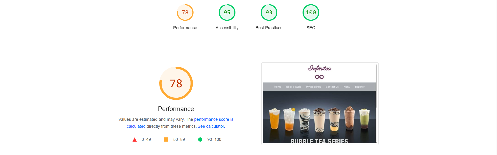
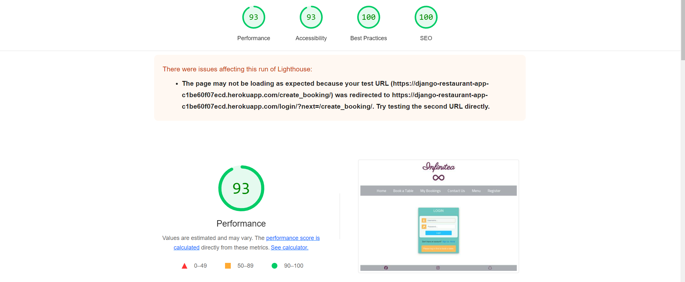
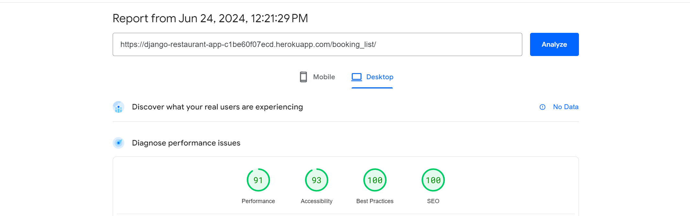
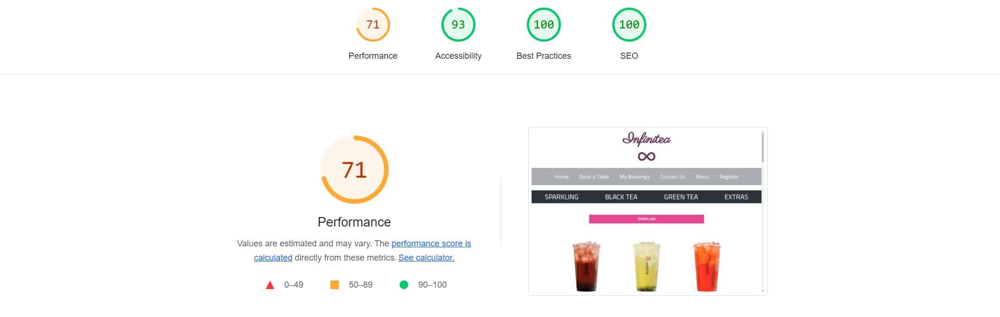
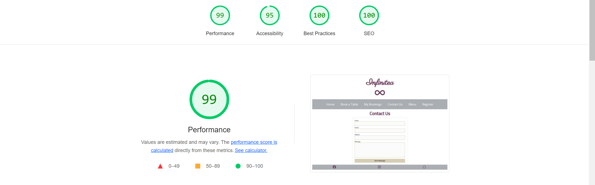
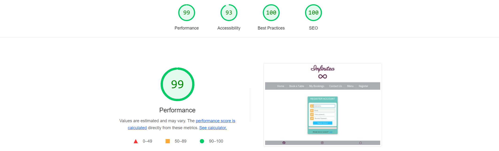

# Manual Testing Table

## Booking Model Tests

| Test Case ID | Test Description                      | Preconditions                             | Test Steps                                                    | Expected Result                                      | Actual Result |
|--------------|---------------------------------------|-------------------------------------------|---------------------------------------------------------------|------------------------------------------------------|---------------|
| TC_Booking_01| Create a new booking                  | User exists in `auth_user`                | 1. Navigate to booking form<br>2. Fill in details<br>3. Submit form | New booking is created and saved in the database      |               |
| TC_Booking_02| Retrieve booking by user              | Booking exists for the user               | 1. Query bookings by user ID                                   | List of bookings for the user is returned            |               |
| TC_Booking_03| Update booking details                | Booking exists                            | 1. Retrieve booking<br>2. Update details<br>3. Save changes   | Booking details are updated in the database          |               |
| TC_Booking_04| Delete a booking                      | Booking exists                            | 1. Retrieve booking<br>2. Delete booking                      | Booking is removed from the database                 |               |
| TC_Booking_05| Create booking with invalid email     | Valid user, invalid email format          | 1. Navigate to booking form<br>2. Enter invalid email<br>3. Submit form | Error message displayed, booking not created          |               |
| TC_Booking_06| Create booking with future date       | Valid user                                | 1. Navigate to booking form<br>2. Enter future date<br>3. Submit form | Booking is created with the future date              |               |
| TC_Booking_07| Create booking with past date         | Valid user                                | 1. Navigate to booking form<br>2. Enter past date<br>3. Submit form | Error message displayed, booking not created          |               |

## ContactMessage Model Tests

| Test Case ID   | Test Description                  | Preconditions                       | Test Steps                                                    | Expected Result                                      | Actual Result |
|----------------|-----------------------------------|-------------------------------------|---------------------------------------------------------------|------------------------------------------------------|---------------|
| TC_Contact_01  | Create a new contact message      | None                                | 1. Navigate to contact form<br>2. Fill in details<br>3. Submit form | New contact message is created and saved in the database |               |
| TC_Contact_02  | Retrieve contact messages         | Contact messages exist              | 1. Query contact messages                                      | List of contact messages is returned                 |               |
| TC_Contact_03  | Validate email format             | None                                | 1. Navigate to contact form<br>2. Enter invalid email<br>3. Submit form | Error message displayed, contact message not created  |               |
| TC_Contact_04  | Validate required fields          | None                                | 1. Navigate to contact form<br>2. Leave required fields empty<br>3. Submit form | Error message displayed, contact message not created  |               |

## User Model (auth_user) Tests

| Test Case ID | Test Description                      | Preconditions                             | Test Steps                                                    | Expected Result                                      | Actual Result |
|--------------|---------------------------------------|-------------------------------------------|---------------------------------------------------------------|------------------------------------------------------|---------------|
| TC_User_01   | Create a new user                     | None                                      | 1. Navigate to user registration form<br>2. Fill in details<br>3. Submit form | New user is created and saved in the database        |               |
| TC_User_02   | Retrieve user by username             | User exists                               | 1. Query user by username                                      | User details are returned                            |               |
| TC_User_03   | Update user email                     | User exists                               | 1. Retrieve user<br>2. Update email<br>3. Save changes         | User email is updated in the database                |               |
| TC_User_04   | Delete a user                         | User exists                               | 1. Retrieve user<br>2. Delete user                             | User is removed from the database                    |               |
| TC_User_05   | Create user with existing username    | User with the same username exists        | 1. Navigate to user registration form<br>2. Enter existing username<br>3. Submit form | Error message displayed, user not created            |               |
| TC_User_06   | Create user with invalid email        | None                                      | 1. Navigate to user registration form<br>2. Enter invalid email<br>3. Submit form | Error message displayed, user not created            |               |


## Automated testing

### Django unit testing


While developing tests I was running the following command:

```
python manage.py test <name of the app>
```

To create the coverage report, I ran the following command:

```
coverage run --source=<name of the app> manage.py test
```
```
coverage report
```
To see the html version of the report, I ran the following command:

```
coverage html
```
```
    python3 -m http.server
```
The link to the server will appear. Click the link to see the report and find out which parts of code has not been covered in testing.


## Validation:
### HTML Validation:

- [Full HTML Validation Report](documentation/full-validation-report.pdf)

- No errors or warnings were found when passing through the official [W3C](https://validator.w3.org/) validator. This checking was done manually by copying the view page source code and pasting it into the validator.


### CSS Validation:

- [Full CSS Validation Report](documentation/css-validation.png)

- No errors or warnings were found when passing through the official [W3C (Jigsaw)](https://jigsaw.w3.org/css-validator/#validate_by_uri) validator.


### JS Validation:

- [Full JS Validation Report](documentation/js-validation.png)

- No errors were found when passing through the official [JSHint](https://www.jshint.com/) validator, However, the validator has pointed out that The body of a for in should be wrapped in an if statement to filter unwanted properties from the prototype.


### Python Validation:

- [Full Python Validation Report](documentation/python-validation.pdf)

- The most common error is that the line is too long when passing through the official [CI Python Linter](https://pep8ci.herokuapp.com/) 


---
## Lighthouse Report

### Home Page



### Booka a Table Page



### Booking List Page



### Menu Page



### Contact Page



### Register Page




---
# Responsiveness

The responsiveness was checked manually by using devtools (Chrome) throughout the whole development. It was also checked with [Responsive Viewer](https://chrome.google.com/webstore/detail/responsive-viewer/inmopeiepgfljkpkidclfgbgbmfcennb/related?hl=en) Chrome extension.

[Responsiveness Report](documentation/responsiveness.pdf)


---
